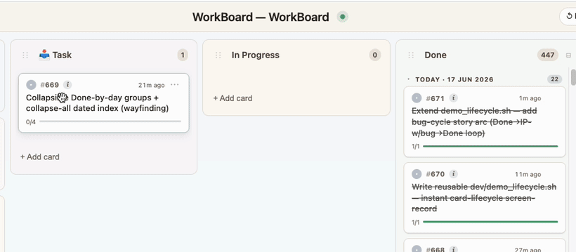
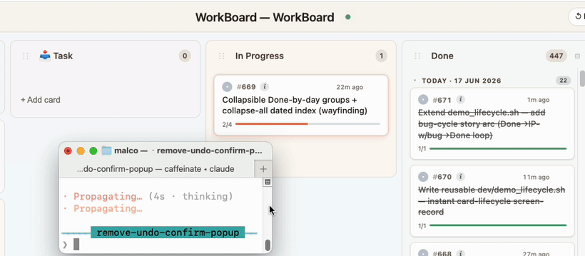

<div align="center">

# 🗂️ WorkBoard

### Live Workboard for Users and Agents

**Watch your work come to life — never lose an idea, never lose a workflow.**

    


</div>

---

## Quick start

Install from the plugin marketplace inside Claude Code:

```
/plugin marketplace add malcolm1232/WorkBoard
/plugin install board-steward@workboard
```

Prefer to install from source? `git clone` it and run `./install.sh` — same result, no marketplace step:

```bash
git clone https://github.com/malcolm1232/WorkBoard
cd WorkBoard
./install.sh   # sets up + auto-detects your projects and bootstraps a board
```

**Requirements:** Claude Code · Python 3.9+ (standard library only, no `pip install`) · macOS / Linux / Windows. **No account, no cloud, no API key required.** (History Replay's optional bootstrap uses Claude Haiku — the cheapest tier — as a one-time, detached subprocess.)

**Where your board lives:** every board is a single file at **`<project>/board/board.json`**, with rolling backups in `board/.backups/`. You never have to hunt for it — whenever you ask Claude for the workboard, *this* is the board that opens (creating a new one opens it in your browser automatically).

---

## The problem

| # | Problem | How WorkBoard solves it |
|---|---|---|
| 1 | **Agent memory is for the agent only — invisible to you.** | WorkBoard is a **visual knowledge-graph for both users *and* agents** — you *see* your work as a live board; the agent walks the same graph. |
| 2 | We **can't keep track of our code**. | WorkBoard **tracks live what Claude is working on** and what it just shipped — without you typing anything. |
| 3 | You're **generating ideas faster** than you can act on them. | Card them on the spot — as cards or subtasks. Later, just say *"Do #426"* — or chain them: *"Do #426, #123 and #99."* Each one picks up exactly where it was left. |
| 4 | You're getting more done than ever — but **how do you remember what shipped**, why, which files? | Every card has a **title** (the gist) and a **short description**; the deeper work (subtasks, writeup, files, commits) hangs off as leaf nodes. Future Claude reads a tiny digest first and **traverses only the leaves it needs** — answering "what did we do on OAuth in May?" costs a handful of tokens, not a re-read of every chat log. |

## The workflow

1. **Every Task is Captured.** Before any work begins, the request is captured as a card in the **Task** column.

2. **Immediately know what Claude is working on.** The moment Claude starts working on it, the card glides into **In Progress** and pulsates — so at a glance you know exactly which card it's on. *Working on multiple projects at once? WorkBoard knows which board belongs to which project and updates each accordingly.*

    

3. **Shipped → Done, with a write-up.** Once finished, Claude writes a description of **what was done**, **why this problem existed in the first place**, and ✓ a write-up of **how it was done**. The card flies to Done.

4. **Bug? Back to In Progress.** If something breaks — or more changes are needed — the card animates **back out of Done** with a `🐞 bug` tag, or with an added subtask if it's just a follow-up.

5. **Re-shipped → Done.** Once fixed, the card returns to Done — with the full ship → bug → fix → ship arc preserved in its history… **ready for traversal**.

---

## Features

### 1. 🏷️ Filter by tag — find what you need fast
When a card is created, it's automatically tagged with the work-type it belongs to (e.g. `UI`, `security`, `bug`, `refactor`). Click any tag chip to filter the board down to only that slice — answering *"what's open on the UI side right now?"* in one click.


### 2. 📅 Calendar View
See what shipped — and what's **still open** — laid out by date. Catch missed work from yesterday, spot productive streaks, or look back at your wonderful week of progress at a glance! You can use it to show your boss what a Teacher's pet you've been (or not).


### 3. ✅ Subtasks track the real work, step by step

**The live tick.** Each card breaks down into the steps the agent will actually take. Subtasks tick off one by one as the work progresses — so even mid-task you can see exactly how far along Claude is (e.g. *2/4*), not just *"in progress."*



**Anatomy of a card.** Subtasks are just one slot. Here's every field that hangs off the title:

- **Origin** — why this card exists, in the user's own words.
- **Subtasks** — the concrete steps Claude will (or did) take, ticked off one by one.
- **Notes** — anything jotted along the way (reasoning, dead ends, decisions).
- **Tags** — work-type chips (`UI`, `security`, `performance`, `infra`, `docs`, `bug`, `refactor`…) — click any to filter the board.
- **Priority** — a `C` / `M` / `L` chip in the corner (Critical / Mid / Low, or unset).
- **Linked files** — auto-attached the moment Claude edits a file under the card. Walks both ways: from card → which files, from a file → which card touched it.
- **Linked cards** — explicit `card.py link <a> <b>` edges between related work. This is the *graph* in "knowledge graph."
- **Write-up** — added when the card flies to Done: what shipped, why, and how it was verified (commits, files, tests).


### 4. `🐞 bug` — The card flies back out of Done, full history kept
**Debugging?** As you (or Claude) is working, it animates back out of Done into In Progress with a `🐞 bug` tag and a new subtask for the fix. The card's history shows the entire ship → bug → fix → ship arc, **so the story is never lost.**



---

## 📊 Token-Efficiency Summary — WorkBoard vs mem0 · claude-mem · Letta · graphify

### Why is WorkBoard cheaper?

1. **Carding is inline — zero extra model calls.** WorkBoard writes the card *during* your normal turn: the agent runs a deterministic `card.py` command and the writeup is text it already produced — **no separate session, no extra inference pass.** mem0, claude-mem and Letta instead spin up a **dedicated model call** to remember (claude-mem compresses *every* session via a ~5K-token call) — pure overhead on top of your normal usage.
2. **It doesn't run on every turn.** Unlike Letta (memory re-sent every turn) and the per-session extractors, WorkBoard writes **only when there's something to record**.
3. **No "full dump."** Even when it records, it never dumps your entire history — it writes **only what's needed**, so it never burns extra tokens.
4. **What it saves is structured, not a blob** — each card carries:
   - **Title** — a one-line overview, for fast future retrieval
   - **Origin / why it exists** (+ **Notes**) — the context behind it
   - **✓ Writeup** — once it's done, *how* it was done (commits, files)
5. **Recall is a cheap tree-walk.** An agent finds a past workflow by traversing the graph — reading the **title** first, the description *only if needed* → **origin / why** → **how it was done** — a handful of tokens, never a re-read of everything.

*[**Read the full study here →**](Research/token_comparison/MASTER_SUMMARY.md)*

**How it works:** WorkBoard's figures are *measured* (its real recall + real bootstrap, run against a frozen snapshot of real Claude-Code history); each peer comes from its own published numbers or a real sandboxed run. **What the rows mean:**

- **Build the memory** — the one-time cost to turn your *past* history into memory.
- **Persist / session** — the ongoing cost to *save* each new session's work.
- **Live loop *(100 sessions × 3 recalls)*** — persist **+** recall combined over a project's life; the real steady-state cost.
- **Per single recall** — tokens to answer *one* question.
- **Recall vs full-context *(26K)*** — savings vs pasting your whole ~26,000-token history into every prompt (the naive baseline mem0's *"90%"* is measured against).
- *(Letta)* **In-context memory / turn** — memory re-sent on **every** turn · *(graphify)* **Always-on / prompt** + **SKILL.md on engage** — per-prompt and on-engagement load.

### WorkBoard vs mem0

| Axis | WorkBoard (WB) | mem0 | Winner |
|---|--:|--:|:--|
| Build the memory | 64,162 Tok | 5,095,769 Tok | 🟢 **WB 98.7% cheaper** |
| Persist / session | **0 model calls** | 1 LLM extract call (~5,462 Tok) + embed | 🟢 **WB (free)** |
| Live loop *(100 sessions × 3)* | 719,700 Tok | 1,086,200 Tok | 🟢 **WB 33.7% cheaper** |
| Per single recall | 2,399 Tok | 1,800 Tok | mem0 *(leaner)* |
| Recall vs full-context *(26K)* | 90.8% fewer | 93.1% fewer | ~tie |

### WorkBoard vs claude-mem

| Axis | WorkBoard (WB) | claude-mem | Winner |
|---|--:|--:|:--|
| Build the memory | ~10,546 Tok | 5,095,769 Tok | 🟢 **WB ~99% cheaper** |
| Persist / session | **0 model calls** | 1 compression call *(full tier)* | 🟢 **WB (free)** |
| Live loop *(100 sessions × 3)* | 719,700 Tok | 1,517,300 Tok | 🟢 **WB 52.6% cheaper** |
| Per single recall | 2,399 Tok | 3,237 Tok | 🟢 **WB 25.9% cheaper** |
| Backfill past history | mines your history | forward-only *(no bulk command)* | 🟢 **WB** |

### WorkBoard vs Letta (MemGPT)

| Axis | WorkBoard (WB) | Letta | Winner |
|---|--:|--:|:--|
| In-context memory / turn | 306 Tok *(0 carried)* | 3,444 Tok *(blocks + tool schemas + prompt)* | 🟢 **WB** |
| Persist / session | **0 model calls** | LLM tool-call per write + compaction | 🟢 **WB** |
| Live loop *(100 × 50 × 3)* | 2,259,400 Tok *(929,400 trimmed)* | 11,909,200 Tok | 🟢 **WB 81.0% cheaper** |
| Per single recall | 2,399 Tok | 1,064 Tok | Letta *(leaner)* |

### WorkBoard vs graphify *(code knowledge-graph — different domain)*

| Axis | WorkBoard (WB) | graphify | Winner |
|---|--:|--:|:--|
| Always-on / prompt | 306 Tok | 61 Tok *(cached)* | graphify |
| SKILL.md on engage | 5,898 Tok | 8,245 Tok *(+9,704 refs)* | 🟢 **WB 28.5% cheaper** |
| Per recall | 2,399 Tok *(work Qs)* | 1,374 Tok *(code Qs)* | different questions |
| Write / keep current | 0 | 0 | tie |
| Big artifact autoload | never | never | tie |

> *WorkBoard's "Build the memory" figure varies with harvest config (hourly bucket size) — both shown are **under 1.3% of the peer's** per-session compression total, so the **reduction %** is the robust number.*

The 130 KB+ `board.json` is **never auto-loaded** — context stays clean no matter how big the board grows.

---

## ⚖️ But what's the disadvantage?

WorkBoard is cheaper because it **only records what gets carded** — structured *outcomes* (what shipped, why, how), **not your entire raw conversation**. That's a real trade-off:

- **It can't recall what was never carded.** If a detail only ever lived in chat and was never written to a card, the board doesn't hold it. In our 20-query test, **1 was an off-board fact** WorkBoard simply couldn't answer — a vector store could.
- **For vague or single-fact recall, a vector memory can win.** mem0 / Letta inject a smaller bundle per single lookup, and a vector store can surface things that were never explicitly carded. WorkBoard wins the *loop* and the multi-card *lifecycle* questions, **not every individual lookup.**
- **It needs the carding habit, and it's project-scoped.** The work has to actually get carded (hook-enforced, but still discipline), and a board is per-project — not cross-project memory.

**So run both.** WorkBoard is the structured project ledger; pair it with a vector memory (mem0, claude-mem, Letta) for the vague *"what did I once say about X?"* recall it doesn't try to cover. They're complements, not substitutes.

---

## Under the hood

### 🔒 Hook-enforced — the board literally can't drift
Four Claude Code hooks keep the agent honest in real time, so tracking isn't a thing the agent *should* do — it's a thing that *happens*:

| Hook | Fires on | What it does |
|---|---|---|
| **SessionStart** | session start | Injects a ~220-token board digest; re-spawns the server if the port died. |
| **UserPromptSubmit** | every prompt | Re-injects the live-lifecycle protocol so work is carded as it happens, never batched at the end. |
| **PreToolUse** | before an Edit/Write | Non-blocking nudge — about to edit a file with no card In-Progress? "Declare a card first." |
| **Stop** | agent ends its turn | Made real edits but ran no `card.py`? It records the gap so the next session reconciles it. Advisory by default (0 tokens, invisible); opt-in strict mode forces same-turn carding. |

The net effect: **the user never has to ask "did you update the board?"** — and that question is the exact failure mode WorkBoard exists to kill.

### Core components

- **Local board server** at `127.0.0.1:7891` — pure Python stdlib, no framework, no dependencies. Serves the animated UI, a live SSE event stream (`/events`), and a tiny REST surface (`/progress`, `/health`, `/rev`). Auto-managed by `launchd` (macOS) / `systemd` (Linux) / Task Scheduler (Windows); the SessionStart hook respawns it if it dies.

- **`board.json` — a knowledge graph in JSON, not a vector DB** — single file per project; cards (nodes) + history/subtasks/links (typed edges). Atomic writes via cross-process `flock`, rolling `.backups/` directory on every write. Deliberate choice over SQLite/Chroma: it's readable, diff-able, copy-pasteable between machines, and git-friendly. The 130 KB+ file is **never auto-loaded** — Claude reads a ~220-token digest first and traverses only the cards it needs.

- **`card.py` — the single canonical write path** — `add`, `fly`, `subtask`, `bug`, `improve`, `show`, `list`, `query`, `digest`. Hooks enforce its use; agents that try to edit `board.json` directly are caught by the Stop backstop and surfaced next session.

- **Live SSE updates** — every write broadcasts a typed event (`card-added`, `card-updated`, `card-removed`, `card-flash`, `column-*`, `rev-bumped`). All open browser tabs and Claude sessions sync in real time, **no polling**.

- **Multi-Claude, multi-board, multi-tab** — every Claude session opens its own `?sid=`-bound tab. Each pulses its **own** active card (`state.activeWork = {sid: {cardId, ts}}`): N concurrent sessions = N concurrent pulses, no fight over a single "current task." A port registry tracks which board belongs to which project; **rev-as-CAS** (`#609`) prevents lost updates when two sessions write the same card simultaneously.

- **Reinforcement: advisory by default, strict on demand** — the Stop hook's sign-off backstop is silent and free (0 tokens, just writes a note). Power users opt in via `BOARD_STEWARD_STRICT=1` — same-turn enforcement that loops the agent back to card the work before ending its turn. Single-shot, with a hard-coded escape so a false positive can't trap the agent.

- **History Replay — fly past work onto a fresh board** — on first run, a detached **Haiku** subprocess (cheapest tier) mines your past Claude Code sessions and reconstructs them as cards, flying them onto the board `task → in-progress → done`, complete with bug-bounces. Runs out-of-band so it never enters the interactive session's context.

- **Crash-safe by construction** — `flock` + rolling backups + a `recover` CLI to restore from any backup; `repair-links` to fix broken cross-card references; `migrate` to evolve the schema. Three months in, your board self-heals.

- **Token-cheap by design** — among the cheapest to **build and maintain**: **0 model calls** to persist your work, and the 130 KB+ `board.json` is **never auto-loaded** into context. See [`docs/TOKEN_BUDGET.md`](docs/TOKEN_BUDGET.md) for the measurements, and [`docs/COMPARISON.md`](docs/COMPARISON.md) for the knowledge-graph-vs-memory-store framing in full.

---

## Optional Installation

**On first run**, WorkBoard reads through your recent Claude Code conversation history to work out what you've been working on, then **prompts you to pick which board to build**. By **default it looks back 2 days**. You can ask for a wider window — e.g. *"build a board from the past 7 days"* — to pull N days of history.

> ⚠️ **Going far back isn't recommended.** The further back you reach, the more work it finds — and you can end up **overpopulated with cards**. The default stays conservative at **2 days** for that reason; widen it only when you actually want a bigger backfill.

---

## Learn more

- [`docs/KEY_FEATURES.md`](docs/KEY_FEATURES.md) — the full feature tour
- [`docs/TOKEN_BUDGET.md`](docs/TOKEN_BUDGET.md) — measured token cost vs. peer memory tools
- [`docs/DEVELOPMENT.md`](docs/DEVELOPMENT.md) — repo layout, internals, and contributing
- [`CHANGELOG.md`](CHANGELOG.md) — release history

---

## License

WorkBoard is licensed under the **Apache License 2.0**.

Apache-2.0 was chosen deliberately. WorkBoard isn't a standalone app — it embeds into your developer workflow, sits inside other people's repos, and runs as a Claude Code plugin that production tooling may rely on. For a primitive like that, the explicit **patent grant** Apache-2.0 provides (which MIT lacks) is the more responsible default: contributors can't later assert patents against the code they shipped, and downstream users get a clear, enterprise-friendly license that's broadly accepted in dev-tool ecosystems (MCP servers, IDE plugins, agent harnesses).

It remains a permissive license — commercial use, modification, and redistribution are all allowed, with attribution preserved.

See [`LICENSE`](LICENSE) for the full text. WorkBoard runs 100% on your machine; your boards and chat history never leave it.
